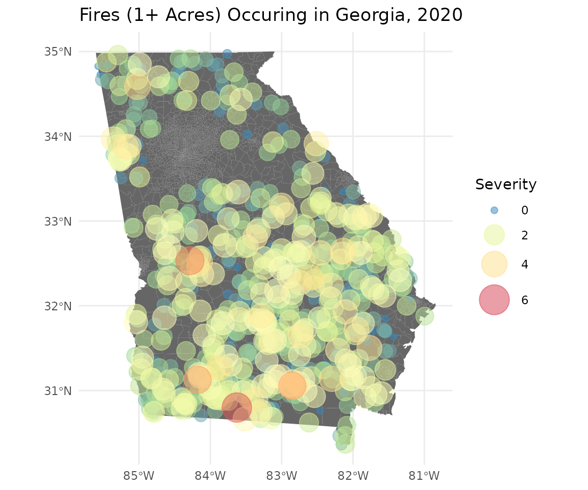
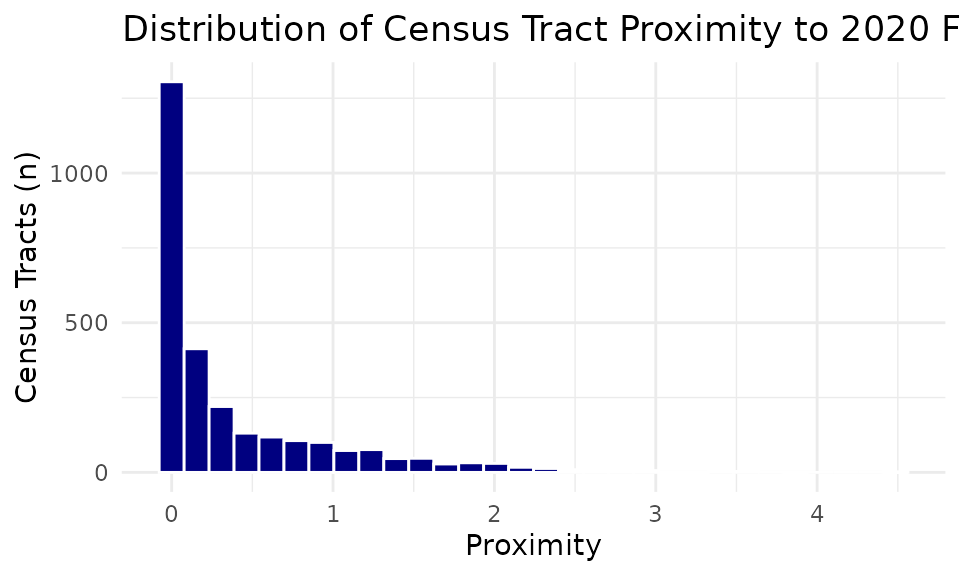
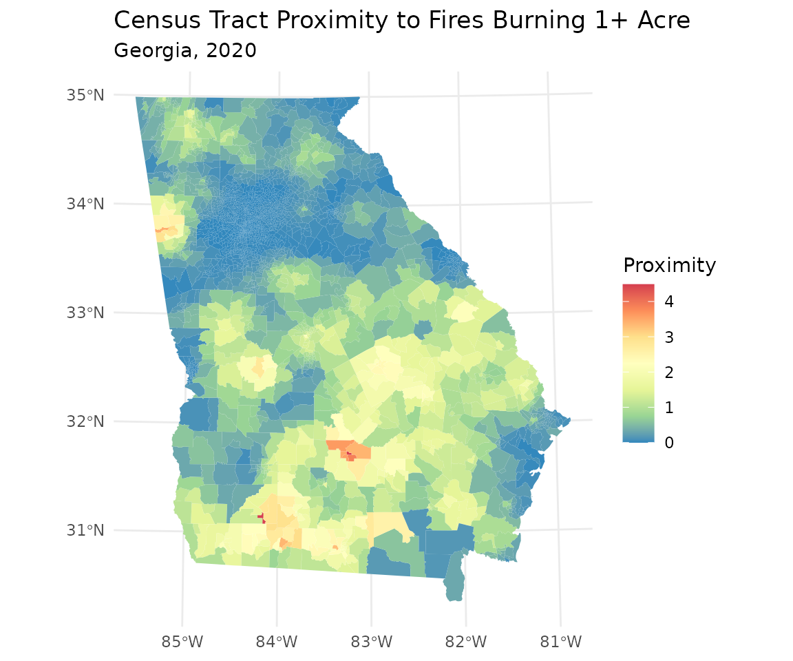

# Vignette 1: Calculate Cumulative Proximity for Geographic Areas

## Introduction

This vignette describes how the
[`get_proximity()`](https://cdcgov.github.io/hazprox/reference/get_proximity.md)
function can be used to calculate cumulative proximity to select
features for a geographic area, such as a county, census tract, or
neighborhood. The
[`get_proximity()`](https://cdcgov.github.io/hazprox/reference/get_proximity.md)
function returns a vector of numeric values representing cumulative
proximity, or how close a community is to the features of interest.

Cumulative proximity:

- Describes how near an area is to all features of interest, with higher
  values indicating that the area is generally closer to features than
  areas with lower proximity values.
- Is calculated by summing the inverse distances between the geometric
  center of each area and all features within a given search distance.
- Can be used to characterize potential population-level risk of
  exposure to environmental hazards.
- Can be weighted to account for the relative importance of each
  feature.

## View hazprox datasets

In this example, we will calculate and analyze the cumulative proximity
to fires occurring in 2020 for census tracts in the state of Georgia. A
simple feature dataset representing all 2020 census tracts in the State
of Georgia is LazyLoaded with `hazprox` and can be accessed directly as
shown below. The Georgia census tracts, `ga`, are provided as a sf
MULTIPOLYGON object, allowing us to perform geospatial analysis of these
data directly. Viewing the `ga` header reveals that the census tracts
are projected in NAD 1983 Georgia Statewide Lambert.

``` r
library(hazprox)
library(dplyr)
library(sf)
library(ggplot2)

#View first 5 census tract records
ga |> slice(1:5)
#> Simple feature collection with 5 features and 4 fields
#> Geometry type: MULTIPOLYGON
#> Dimension:     XY
#> Bounding box:  xmin: -210677.2 ymin: 11751900 xmax: 289688.3 ymax: 12254400
#> Projected CRS: NAD_1983_Georgia_Statewide_Lambert
#>   STATE       GEOID LSAD  POP                       geometry
#> 1    GA 13101880100   CT 1358 MULTIPOLYGON (((139670.9 11...
#> 2    GA 13271950500   CT 2897 MULTIPOLYGON (((123993.4 12...
#> 3    GA 13185011100   CT 3643 MULTIPOLYGON (((61964.23 11...
#> 4    GA 13277960700   CT 4639 MULTIPOLYGON (((-26934.43 1...
#> 5    GA 13095001500   CT 1803 MULTIPOLYGON (((-210579.6 1...
```

The `hazprox` package also includes a dataset with information on 16,195
fires occurring in the state of Georgia from 2016 through 2020. The
fires dataset is derived from the National Interagency Fire Occurrence
6th Edition (1992-2020) dataset. These data are bundled with the
`hazprox` package as a comma separated values file (`ga_fires.csv`) to
demonstrate how to transform latitudinal and longitudinal coordinates
for analysis.

``` r
#Import fires dataset
fname <- system.file("extdata/ga_fires.csv", package = "hazprox")
ga_fires <- read.csv(fname)

#View first 5 records in the Georgia fires dataset
ga_fires |>
  select(Event, CauseType, Acres, Owner, Lat, Lon) |>
  slice(1:5)
#>                       Event CauseType Acres  Owner      Lat       Lon
#> 1   Recreation and ceremony     Human 22.00   USFS 34.75000 -83.77806
#> 2 Equipment and vehicle use     Human  0.10 COUNTY 34.63361 -85.05861
#> 3 Equipment and vehicle use     Human  1.00   USFS 33.38306 -83.41667
#> 4   Recreation and ceremony     Human  0.25   USFS 33.56028 -83.30667
#> 5   Recreation and ceremony     Human  0.10   USFS 33.03500 -83.72306
```

Each record in the `ga_fires` dataset includes latitude (Lat) and
longitude (Lon) coordinates representing the location for each fire
origin. We will need to convert these records into spatial points before
calculating proximity. You can use the
[`help()`](https://rdrr.io/r/utils/help.html) function to view metadata
for datasets bundled with hazprox. The metadata includes important
information about each dataset, including its source, field
descriptions, and processing steps that were performed during dataset
preparation.

``` r
help("ga_fires")
```

The `ga_fires` documentation indicates that the geographic coordinates
are in North American Datum of 1983 (NAD 83). We can use the sf library
to convert these data to a points simple feature.

``` r
fires_sf <- st_as_sf(ga_fires, coords = c("Lon", "Lat"), crs = 4269)
```

## Prepare data for analysis

For this demonstration, because we are only interested in fires
occurring during 2020, we will filter the `fires_sf` dataset based on
the `Year` column.

``` r
fires_sf <- fires_sf |> filter(Year == 2020)
```

The `fires_sf` dataset contains a column for the total number of acres
burned (Acres). We can use this information to weight each fire by
severity. First, let’s examine the distribution of acres burned.

``` r
summary(fires_sf$Acres)
#>    Min. 1st Qu.  Median    Mean 3rd Qu.    Max. 
#>   0.010   0.200   0.750   3.421   2.675 309.400
```

The number of acres burned shows a highly right-skewed distribution.
Most fires burn fewer than 7 acres of land; however, the largest fire
burned over 300 acres. For this analysis, we will exclude fires less
than one acre and create a weight based on the number of acres burned.
Due to the skewed distribution, we will log-transform acres.

``` r
fires_sf <- fires_sf |>
  filter(Acres >= 1) |>
  mutate(Severity  = log(Acres))
```

## Visualize fires

Let’s take a look at where fires are located throughout Georgia by
plotting the fire coordinates on a map of Georgia. We will vary the size
and color of each point by the weight we calculated in the previous step
to highlight where the most severe fires were located.

``` r
fires_sf |>
  arrange(Severity) |>
  ggplot() +
  geom_sf(data = ga, color = NA, fill = "gray40") +
  geom_sf(aes(size = Severity, color = Severity), alpha = 0.5) +
  scale_color_distiller(palette = "Spectral", 
                        limits = c(0, 6), 
                        breaks = seq(0, 6, by = 2), 
                        guide = 'legend') +
  scale_size_continuous(range = c(2, 10), 
                        limits = c(0, 6), 
                        breaks = seq(0, 6, by = 2)) +
  labs(title = "Fires (1+ Acres) Occuring in Georgia, 2020") +
  theme_minimal()
```



Fires are dispersed throughout most the state, with the exception of the
Atlanta metro area. The largest fires appear to be clustered within the
southwestern quadrant of the state.

## Calculate proximity

Next, let’s examine how the cumulative proximity is distributed across
census tracts in the state using the
[`get_proximity()`](https://cdcgov.github.io/hazprox/reference/get_proximity.md)
function. We will weight each fire by the log of the total acres burned
(severity). We can also exclude fires occurring more than 25 km from
each block group boundary by setting the tolerance to 25. Note, other
units of length can be used to specify the tolerance by providing a
“units” argument (e.g., units = ‘mi’).

Although we previously converted our fires data to spatial data with an
associated geographic coordinate reference system, these data are not
currently projected. Typically, we want both our polygon features and
our hazards to have the same projected coordinate reference system
(CRS), but let’s see what happens if we neglect to project one of our
inputs.

``` r
wts <- fires_sf$Severity
ga$Proximity <- get_proximity(ga, fires_sf, tolerance = 25, weights = wts)
#> to does not have a projected CRS.
#> Projecting to into (+proj=lcc +lat_0=0 +lon_0=-83.5 +lat_1=31.4166666666667 +lat_2=34.2833333333333 +x_0=0 +y_0=0 +datum=NAD83 +units=us-ft +no_defs).
```

When we apply
[`get_proximity()`](https://cdcgov.github.io/hazprox/reference/get_proximity.md)
to the unprojected fire locations, we get the following warning message:

    to is not in a projected CRS.

    Projecting to into (+proj=lcc +lat_0=0 +lon_0=-83.5 +lat_1=31.4166666666667 +lat_2=34.2833333333333 +x_0=0 +y_0=0 +datum=NAD83 +units=us-ft +no_defs).

This message informs us that because fires_sf lacks a projection, the
`get_proximity` function has projected it for us using the same CRS as
the from layer (`ga`). Note, this message does not indicate an error.
The function will succeed when only one of the input datasets is not
projected because it assumes that the unprojected data should have the
same CRS as the other input. However, if neither input has a projected
CRS or if they have a different CRS, `get_proximity` will return an
error.

## Descriptive statistics

Now let’s examine the distribution of the proximity value by requesting
a histogram.

``` r
ggplot(ga, aes(Proximity)) +
  geom_histogram(fill = "navy", color = "white") +
  ggtitle('Distribution of Census Tract Proximity to 2020 Fires')+
  ylab('Census Tracts (n)') +
  theme_minimal()
#> `stat_bin()` using `bins = 30`. Pick better value `binwidth`.
```



Most tracts have relatively low proximity. The median score is 0.104.
However, a few tracts have very high proximity scores.

## View map of proximity

We can use `ggplot2` to visualize the geographic distribution of census
tracts across Georgia by proximity score.

``` r
ga |>
  ggplot(aes(fill = Proximity)) +
  geom_sf(color = NA) +
  scale_fill_distiller(palette = "Spectral") +
  labs(title = "Census Tract Proximity to Fires Burning 1+ Acre",
       subtitle = "Georgia, 2020") +
  theme_minimal()
```



The choropleth map above highlights census tracts with greater overall
proximity to fires burning more than one acre in 2020. This map appears
to agree with the overall trend displayed in the point-level map, but it
provides more visual clarity and reveals tracts outside the southwest
quadrant with high proximity. This concludes the `get_proximity`
vignette; however, users may consider additional applications of
cumulative proximity statistics to public health issues. For example,
proximity scores can be used to identify communities or facilities with
the most potential for exposure to various environmental health risks.
Proximity scores can be used to target health education and outreach or
used to model relationships between population-level exposure burden and
health outcomes.
